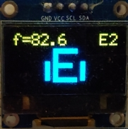

# PIC8-guitar-tuner
A guitar tuner on 8-bit pic microcontroller, testing different DSP techniques that can be effective on a low end microcontroller

IDE: MPlab X  
Compiler: XC8  

- Autocorrelation
  - [-] AMDF average magnitude difference function with parabolic interpolation
    - TODO: Improve accuracy
    - TODO: Reduce harmonic problems in auto-detect mode
  - [ ] Autocorrelation (not implemented)
- Low-pass filtering
  - [-] IIR elliptic filter implemented with fixed point direct form I (In progress)

project configurations  
- `sim` configuration  
  - SCL sim file for injecting values to ADC
    - Doesn't work with FVR
  - f_to_mv.py for generating test data
- `pickit3` configuration
  - Device programmer 
